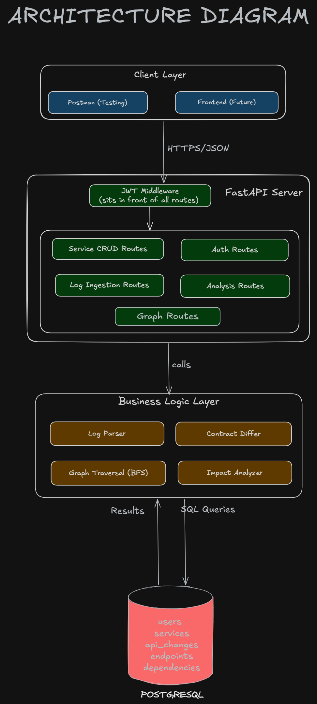

# System Architecture

## Overview
The API Dependency Graph Analyzer is a monolithic FastAPI application
with a layered architecture. It auto-discovers API dependencies from 
logs and predicts which services will break before a breaking change is deployed.



## Architecture Style: Monolithic (Layered)
This is a **monolith** — one deployable unit — but organized in layers 
so each concern is separate. This is the right choice for v1 because:
- Simpler to build, test, and deploy
- Easy to refactor into microservices later if needed
- No network latency between layers

## Layers

### 1. Client Layer
Who talks to our API:
- **Postman** — for manual testing during development
- **Future: Web frontend** — for visual dependency graph exploration
- **Future: CI/CD pipelines** — to check for breaking changes before deployment

### 2. API Layer (FastAPI Routes)
Receives HTTP requests, validates input, returns HTTP responses.
Does NOT contain business logic — just routing and validation.

| Route Group | Prefix | Purpose |
|---|---|---|
| Auth | `/v1/auth` | Register, login, get JWT token |
| Services | `/v1/services` | CRUD for microservices |
| Endpoints | `/v1/endpoints` | CRUD for API endpoints within services |
| Log Ingestion | `/v1/ingest` | Receive and process API call logs |
| Analysis | `/v1/analyze` | Detect breaking changes, calculate impact |
| Graph | `/v1/graph` | Query dependency relationships |

### 3. Business Logic Layer (Services)
The brain of the application. Pure Python — no HTTP, no database calls directly.

- **Log Parser**: Reads raw API call logs → extracts caller/callee relationships
- **Contract Differ**: Compares old vs new API schemas → flags breaking changes
- **Graph Traversal (BFS)**: Given a service, find all downstream consumers using Breadth-First Search
- **Impact Analyzer**: Scores each downstream service by probability of breaking

### 4. Data Layer (PostgreSQL via Supabase)
Persistent storage. Accessed only through SQLAlchemy ORM.

| Table | Purpose |
|---|---|
| `users` | Auth — stores hashed passwords |
| `services` | Registry of all microservices |
| `endpoints` | API endpoints belonging to each service |
| `dependencies` | Which service calls which endpoint |
| `api_changes` | History of contract changes |

## Data Flow Examples

### Registering a new service
```
Client → POST /v1/services → JWT Middleware → Service Route → SQLAlchemy → PostgreSQL
```

### Ingesting API call logs
```
Client → POST /v1/ingest/logs → JWT Middleware → Log Ingestion Route 
       → Log Parser → Dependency Builder → PostgreSQL
```

### Analyzing a breaking change
```
Client → POST /v1/analyze/change → JWT Middleware → Analysis Route 
       → Contract Differ → Graph Traversal (BFS) → Impact Scorer 
       → Response with affected services + scores
```

## Key Design Decisions

| Decision | Choice | Why |
|---|---|---|
| Framework | FastAPI | Auto-generates docs, async support, type safety |
| Database | PostgreSQL | Relational data fits dependency graphs well |
| Auth | JWT | Stateless — no session storage needed |
| ORM | SQLAlchemy | Prevents SQL injection, easier migrations |
| Graph algorithm | BFS | Finds ALL downstream consumers level by level |
